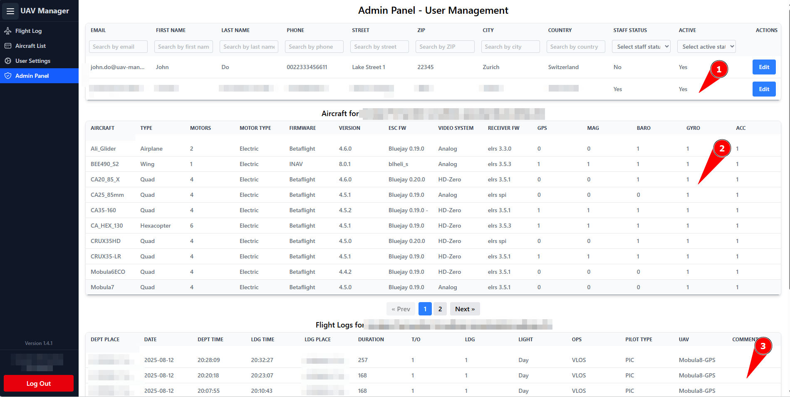

# Admin Panel

For the Admin Panel to be visible, the _is\_staff_ flag must be set. In the Admin Panel, administrators can manage all users and view their UAVs as well as flight logs.

<figure><figcaption></figcaption></figure>

1.) All registered users. With _Edit_, the user data can also be modified.\
2.) All UAVs of the user selected above are displayed.\
3.) All flight logs of the user selected above.

## Create Admin User

If a user has the `is_staff` flag, they will see an Admin Panel entry in the sidebar. By default, new users are not admins when they register.\
To create an admin user, you need to generate a superuser in Django using the command:

```
python manage.py createsuperuser
```

With the newly created superuser, you can log in to the UAV Manager application. There you will see the Admin Panel menu entry in the sidebar. When you click on it, you will land on the Admin Page where you can edit other users and also set them as staff. After that, you can delete this superuser right there if you no longer need it.\
Alternatively, if you do not want to create a superuser, you can set the flag directly in the database using SQL, for example with pgAdmin.\
My Docker Compose file automatically installs a pgAdmin instance for this purpose.
