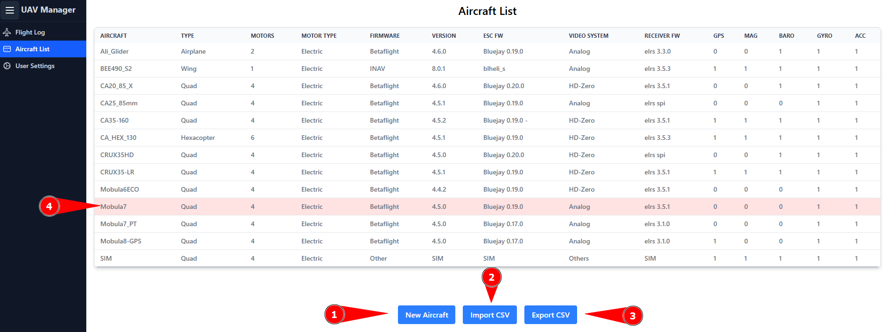
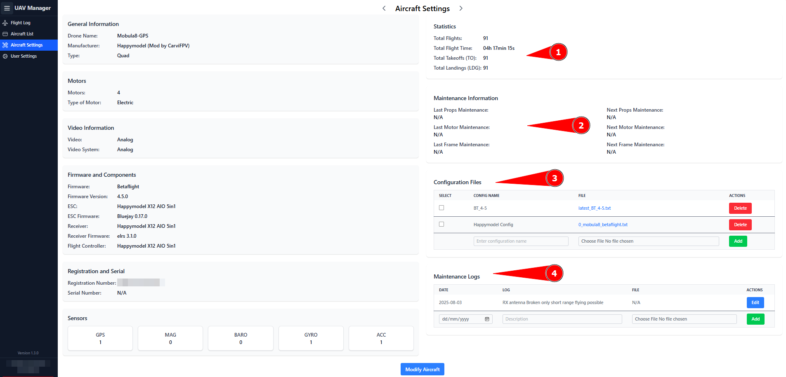
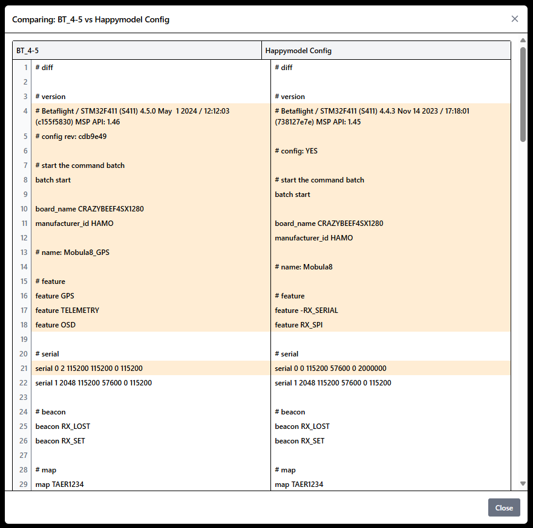
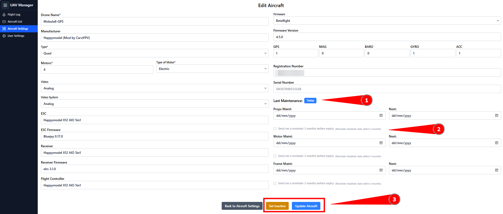
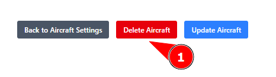

# UAV / Aircraft Managment

### Aircraft List

The _Aircraft List_ displays all UAVs you have created in the manager.

<figure><figcaption></figcaption></figure>

1.) If the list is empty, or if a UAV is not yet registered in the UAV Manager, click _New Aircraft_ to add it.

2.) You can also import a complete CSV file containing multiple UAVs at once.\
In this case, the header row must be **exactly** as follows:

```
drone_name,manufacturer,type,motors,motor_type,video,video_system,esc,esc_firmware,receiver,receiver_firmware,flight_controller,firmware,firmware_version,gps,mag,baro,gyro,acc,registration_number,serial_number
```

**Example CSV content:**

```
Ali_Glider,CarviFPV,Airplane,2,Electric,Analog,Analog,JHEMCU GSF405A-BMI,Bluejay 0.19.0,JHEMCU GSF405A-BMI,elrs 3.3.0,JHEMCU GSF405A-BMI,Betaflight,4.6.0,0,0,1,1,1,,
BEE490_S2,CarviFPV,Wing,1,Electric,Analog,Analog,Mateksys F765-WSE,blheli_s,EP1 TCXO Receiver,elrs 3.5.3,Mateksys F765-WSE,INAV,8.0.1,1,1,1,1,1,,
CA20_85_X,CarviFPV,Quad,4,Electric,Digital,HD-Zero,GOKU F405 HD 1-2S ELRS AIO V2,Bluejay 0.20.0,GOKU F405 HD 1-2S ELRS AIO V2,elrs 3.5.1,GOKU F405 HD 1-2S ELRS AIO V2,Betaflight,4.6.0,0,0,1,1,1,,
```

To see all available attributes, it’s best to check in the GUI under _New Aircraft_.

3.) You can also export a list of all UAVs. The exported file will have the same format as the CSV import. Please note that maintenance flags/dates or maintenance/configuration logs are not included in this CSV. For a complete export, see the [_Import/Export_](integrations.md) chapter.

4.) If a UAV is marked with a bright red background, it means that it has been set to inactive.

### Aircraft Settings

Clicking on a UAV in the aircraft list will open its Aircraft Settings.

<figure><figcaption></figcaption></figure>

The Aircraft Settings display a detailed view of all UAV attributes.

1.) Displays detailed statistics for the selected UAV.

2.) Here, if set, you can see when the last maintenance was performed and when the next maintenance is due.

3.) Here, you can upload configuration files such as `.txt`, `.json`, or `.csv`—for example, a diff file from Betaflight or INAV. If multiple files are uploaded, you can select two files on the left and then compare them line by line.&#x20;

<figure><figcaption></figcaption></figure>

4.) Maintenance notes can be added here, with or without attachments. You can also upload and store files such as Blackbox log files.

### Modify / Edit Aircraft

<figure><figcaption></figcaption></figure>

1.) The "Today" button sets the current date on all three fields and sets the next maintenance date exactly one year into the future.

2.)  Here you can set a reminder. To prevent the reminder from being automatically dismissed, the next maintenance date must be set **after** the reminder date. The reminder lead time can be adjusted in the [User Settings](interactive-blocks.md).

3.) Using **"Set inactive"** will lock the UAV and mark it as inactive. This option is only available if the UAV has at least one flight recorded in the [flight log](markdown.md).

If no flights are registered, the UAV can be deleted (1). See the screenshot below.

<figure><figcaption></figcaption></figure>

**Update Aircraft** applies the changes you made previously.
