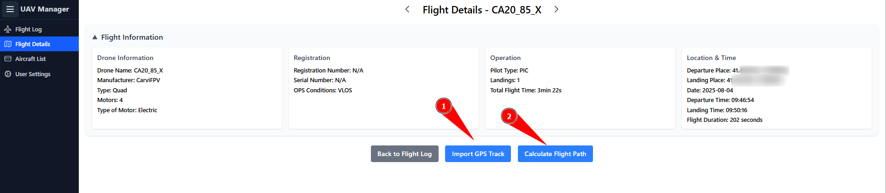

# Flight Details

The Flight Details page displays all specific data for a flight. Without additional telemetry logs, only the data recorded in _flylog.csv_ is shown. However, if further telemetry data for a specific flight is available, it can be added.

<figure><figcaption></figcaption></figure>

1.) Import GPS Track: In principle, all _tellog.csv_ logs can be uploaded, including those from UAVs without GPS. In such cases, the GPS values will always be `00.00000 00.00000` and will therefore simply be displayed at the zero point on the map. However, if a barometer is installed, its data will be displayed correctly. The artificial horizon and other features should also always work.

2.) Especially for UAVs without GPS, the entire flight most likely took place nearby. Therefore, there is the option to roughly estimate the flight path based on the initial heading, the average speed, and a defined flight area. _Please note that this represents more of a flight area rather than an exact flight track._
