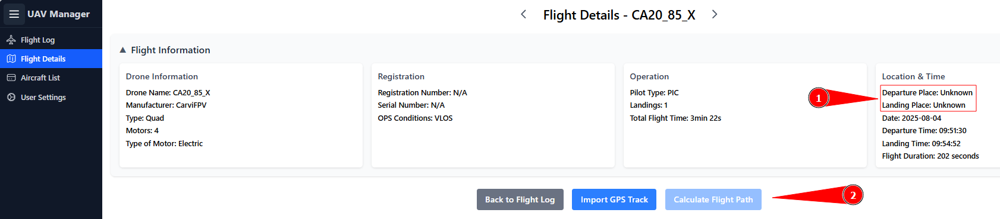
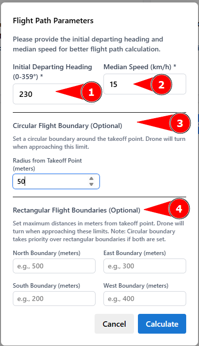
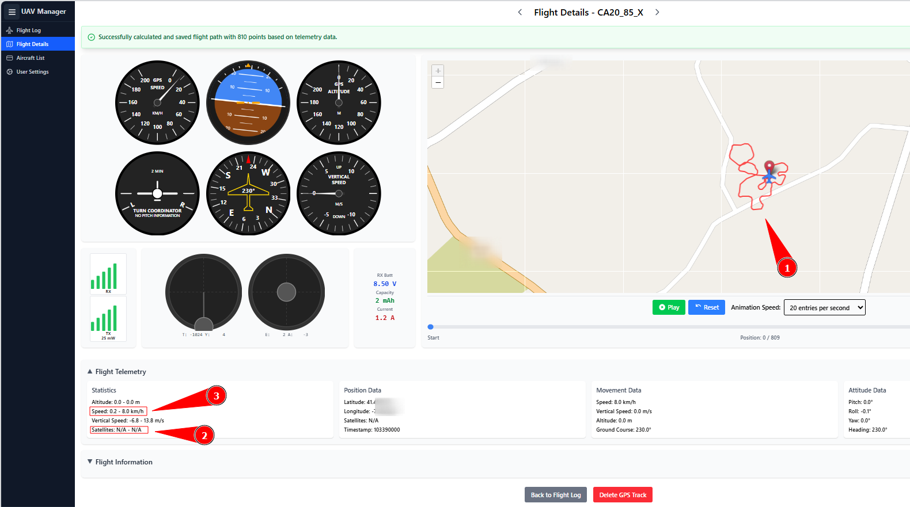

# Calculate Flight Path - (without GPS)

If a UAV does not have a GPS module installed, a rough flight path can be calculated based on the attitude, initial heading, and average flight speed. Note: this serves more as a rough estimation of the flight area rather than an actual flight path.

<figure><figcaption></figcaption></figure>

1.) It is important that initial GPS coordinates for takeoff and landing are provided. This allows the UAV Manager to define a starting point.

2.) Once takeoff and landing are known, the _Calculate Flight Path_ button is enabled.

<figure><figcaption></figcaption></figure>

1.) Initial departing heading is required to define the initial course.\
2.) Median speed, which should be a rough estimate and generally slightly lower than the actual speed.\
3.) Using this, the maximum distance can be entered. This is especially important for flights with varying speeds, otherwise slower segments may be displayed too large.\
4.) If, for example, the UAV started at the edge of a field, it is better to use this function to define the field rather than a simple circle.

<figure><figcaption></figcaption></figure>

1.) For artificially generated calculated flights, the entire flight path is shown in red. This is correct, since no GPS data was available and the calculated path is always highly inaccurate.\
2.) GPS satellites are always set to 0 or n/a in this case.\
3.) The maximum speed corresponds to the median speed, and during the last 20% of the flight the speed is reduced to nearly zero.
