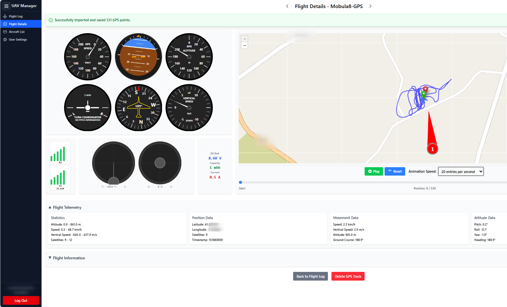
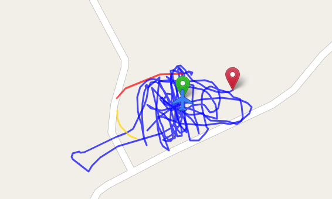

# Import GPS Track

With the _Import GPS Track_ function, all data recorded in _tellog.csv_ can be visually displayed in the Flight Details page.

<figure><figcaption></figcaption></figure>

In the top left, we have the standard six-pack flight instruments, which display the corresponding data during flight track playback. Below that on the left, the RX/TX signal strength is shown. In the center, beneath the six-pack, we display the RC stick inputs, and on the right below the six-pack, the motor and battery data. On the left, under point 1, the flight track itself is visible.

At the bottom, the red button can be used to delete the _tellog.csv_ file, in case an incorrect telemetry log was uploaded.

<figure><figcaption></figcaption></figure>

In the Flight Map, the flight is shown in three colors: blue indicates that 6 or more satellites were available, yellow means between 4 and 6 satellites, and red represents fewer than 4 satellites. This way, you can quickly assess visually whether the flight track is accurate or potentially imprecise.
