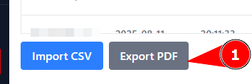
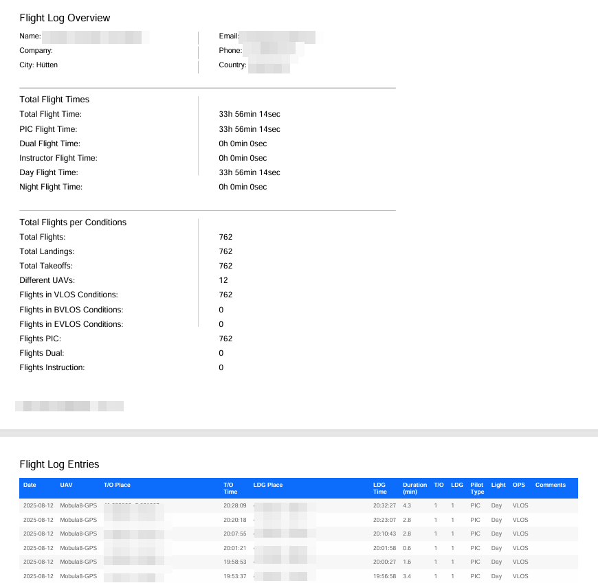
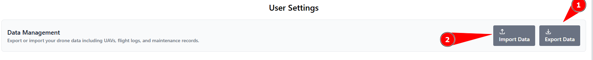

# Import / Exports

This chapter summarizes the import/export functions of the UAV Manager. Some of these have already been mentioned in other chapters and therefore appear twice. In the future, it is planned to consolidate all import functions within the UAV Manager into a dedicated separate page.

<figure><figcaption></figcaption></figure>

1.) Next to the _Import CSV_ button on the Flight Log page, there is the _Export PDF_ button. This generates a PDF containing a summary of all flight hours, followed by tables listing all individual flights in tabular form. See image below.

<figure><figcaption></figcaption></figure>

In addition, under the _User Settings_ page, there is a banner for the Import/Export function. This exports all data of the logged-in user, including aircraft attachments, except for the personal data stored on the User Settings page. With an import, this data can be uploaded in bulk. This can be used for migrations. In the future, it is planned to optionally allow exporting/importing of the User Settings as well.

<figure><figcaption></figcaption></figure>

1.) Exports all data except User Settings.\
2.) Imports an export created with option 1.

