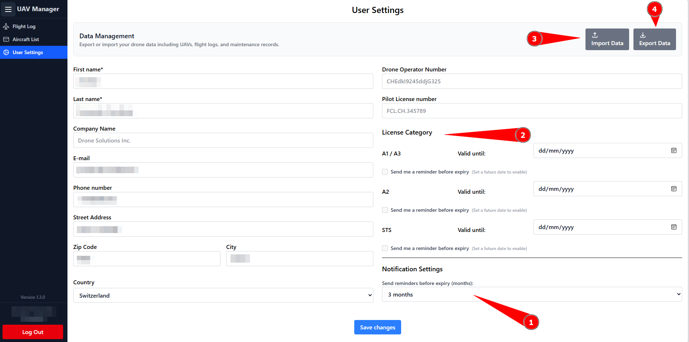

# User Settings

Under _User Settings_, all personal information of the currently logged-in user is displayed. At the top, there is also a banner for Import/Export, which is explained in more detail in the next chapter

<figure><figcaption></figcaption></figure>

.) Here you can set when the reminder should become active before something expires. This also applies to the maintenance reminders under _Aircraft Settings_.\
2.) Under _License Category_, the current licenses of the logged-in user can be entered and reminders can be activated.\
3.) Here, a general import can be uploaded, which was created with option 4.\
4.) Creates a complete export of all flights including telemetry logs, as well as all UAVs including maintenance and configuration logs. Only the user settings are NOT exported — these must always be entered manually.
