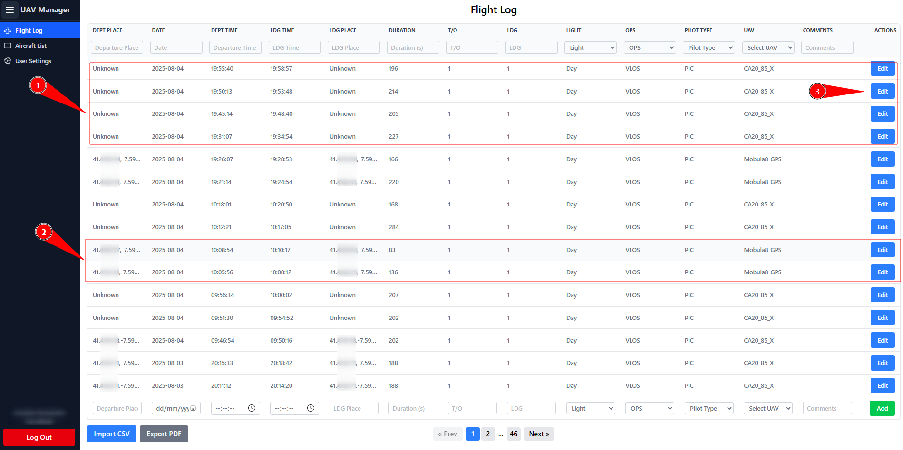
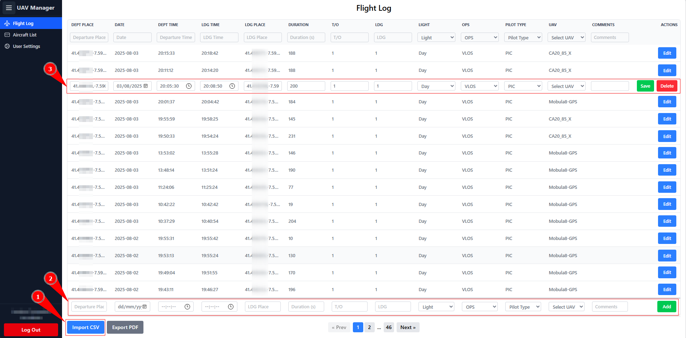
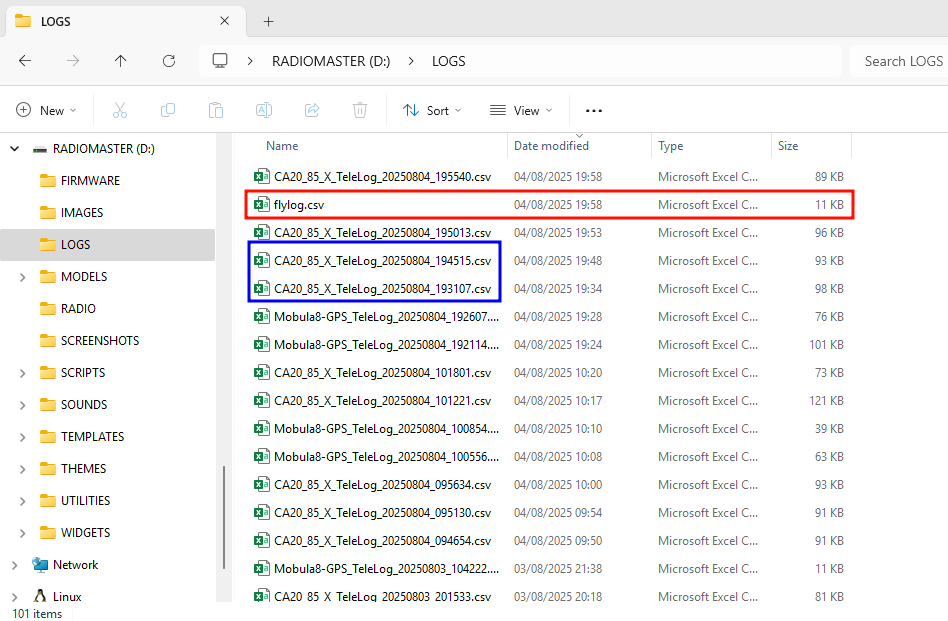

# Flight Log&#x20;

<figure><figcaption></figcaption></figure>

1.)These flights were imported via CSV, and the drone did not have GPS. This is the reason why the departure and landing locations are listed as “Unknown.”

2.) This is an example of a drone that had GPS, where you can find the GPS coordinates for the departure and landing points.

3.) With “Edit,” you can modify the flight. Usually, you can add GPS coordinates for flights that do not have GPS. This will be useful later on the [Flight Details](images-and-media/) page, where you can calculate the flight path for flights without GPS.

<figure><figcaption></figcaption></figure>

1.) With the “Import CSV” button, you can import the flight log generated by the flylog.lua script.

<figure><figcaption></figcaption></figure>

In red, you see the flylog.csv file, which is located under “LOGS” in your transmitter if you have set up the flylog.lua script. You can import this file here.

In blue is the Flight Details telemetry log from the tellog.lua script. Therefore, in [Flight Details](images-and-media/), you will find more information about the flight.

<figure><figcaption></figcaption></figure>

When you import the latest flight, it will check the departure date and time, and if a log already exists, it will skip it. This way, you can always use the same file without creating duplicate flights.

You will also see if a flight is not imported because no matching UAV could be found.

2.) You can also add a flight manually, but it’s recommended to import.

3.) This is what it looks like when you click on “Edit.”
