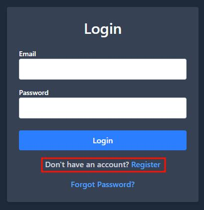
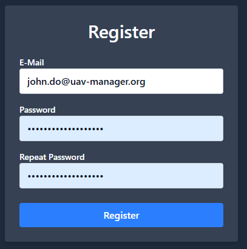
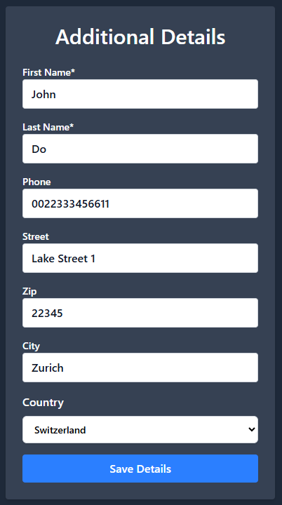
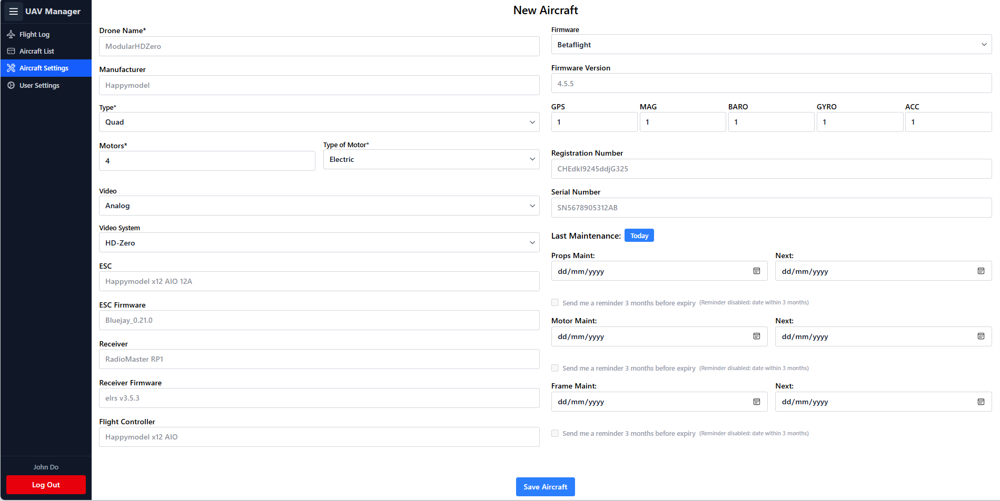

# First Use & User Registration

Once the application is up and running, you’re ready to access UAV Manager for the first time.

### Step 1: Open the Application

Open your browser and navigate to the frontend URL:

* **Local Docker Deployment**: [http://localhost:5175](http://localhost:5175)
* **Manual Frontend Dev Server**: [http://localhost:5173](http://localhost:5173)
* **Production Deployment**: Your configured domain (e.g., `https://yourdomain.com`)

### Step 2: Register a New User

When you visit the application for the first time, you'll be taken to the **Login page**.

* Click on **“Don’t have an account? Register”** below the login form.

<figure><figcaption></figcaption></figure>

* Fill out the registration form with:

<figure><figcaption></figcaption></figure>

* Additional Details:\
  Only **First Name** and **Last Name** are mandatory when registering a new account. However, the more information you provide, the more complete and useful the data will be — especially for **PDF exports** and **statistics reports** later on.

<figure><figcaption></figcaption></figure>

✈️ After Registration: Add Your First Aircraft

Once you've saved your **Additional Details**, you will be automatically redirected to the **New Aircraft** page.\
This behavior is intentional — before logging any flight time, you must first register at least one **UAV / Aircraft**.

> ✅ **Important:**\
> If you're using the **Flylog LUA script** (highly recommended), make sure that the **UAV name in UAV Manager exactly matches** the name of the UAV or aircraft configured in your **EdgeTX transmitter**.
>
> The system maps flight logs based on this **exact name match**, so consistency is critical for correct association and automated log linking.

<figure><figcaption></figcaption></figure>
