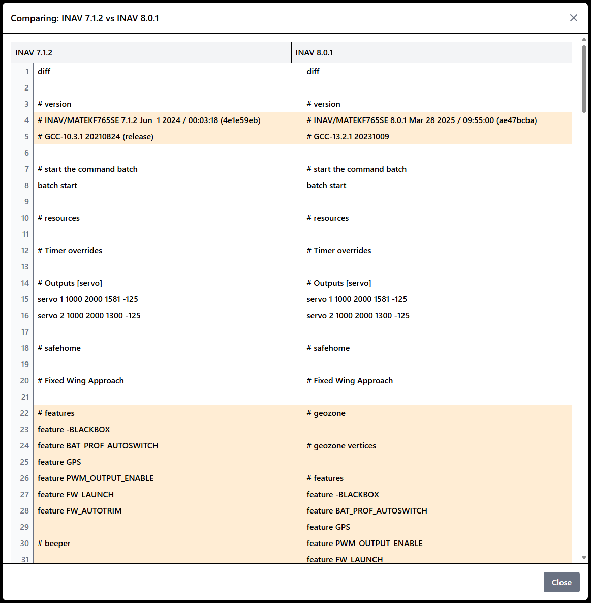

# UAV Manager

**UAV Manager** is a modern full-stack web application for managing drones (UAVs), flight logs, maintenance records, and user profiles. The application is designed for drone pilots, clubs, and small companies who want to efficiently manage their fleet and operations digitally.

## Features

- **Drone (UAV) Management**: Maintain any number of UAVs with full technical specifications and custom attributes.
- **Configuration File Comparison**: Upload, manage, and compare configuration files for each UAV. Visual diff view for easy comparison of changes between two selected config files.
- **Flight Logbook**: Record detailed flight entries, filter and search by date, UAV, conditions, and pilot type.
- **Maintenance Tracking**: Log maintenance events, attach files, and set up automated reminders.
- **Flight Data Logging & Visualization**: Upload and visualize extensive flight telemetry data (GPS tracks, speed, altitude, vertical speed, attitude, control inputs, signal and telemetry data) directly in the flight log – including interactive maps, instrument displays, and animated flight paths.
- **Import/Export**: CSV import/export for UAVs and flight logs; full user data backup and restore via ZIP.
- **PDF Export**: Export flight logs and statistics as a formatted PDF report for documentation or sharing.
- **User & Admin Panels**: Secure JWT-based authentication, user self-service settings, and admin oversight of all data.

---

### Application Overview

|                   Flight Log                   |                     Flight Details                     |                  Config Comparison                  |
| :--------------------------------------------: | :----------------------------------------------------: | :-------------------------------------------------: |
|  |  |  |

|                       Aircraft Settings                       |                     Aircraft List                     |
| :-----------------------------------------------------------: | :---------------------------------------------------: |
|  |  |

---

> **Note:**  
> To record flight hours and telemetry logs, you need both Lua scripts from [https://github.com/CarviFPV/flylog_edgetx](https://github.com/CarviFPV/flylog_edgetx).  
> The logs generated by these Lua scripts can then be uploaded to the UAV Manager.

## Prerequisites

- Docker & Docker Compose (for containerized deployment)
- Node.js & npm (for local frontend)
- Python 3.13.1 & pip (for local backend)
- PostgreSQL

---

## Quick Start: Installation with Docker (recommended)

1. **Clone the repository**

   ```bash
   git clone https://github.com/CarviFPV/UAV_Manager.git
   cd UAV_Manager
   ```

2. **Build and start Docker containers**

   ```bash
   docker compose build
   docker compose up -d
   ```

3. **Open the frontend:**  
   [http://localhost:5175](http://localhost:5175)

> **Note:**  
> For use in a network (not localhost), you must adjust the `VITE_API_URL` environment variable.

---

**Cron Jobs for Reminders**

To enable automatic reminders for license expiry (e.g., "License valid until") and upcoming maintenance events, you need to set up cron jobs for the backend.  
The application uses `django-crontab` to schedule these jobs. The relevant cron job is already configured in `settings.py`:

```python
CRONJOBS = [
    ('0 7 * * *', 'api.services.user_service.UserService.check_license_expiry'),
    ('0 8 * * *', 'api.services.maintenance_service.MaintenanceService.check_maintenance_reminders'),
]
```

This job runs every day at 7:00 AM and checks for licenses and maintenance reminders according to the user's notification settings ("Send reminders before expiry (months)").  
To activate the cron jobs, run the following command in your backend directory:

```bash
python manage.py crontab add
```

You can check the current cron jobs with:

```bash
python manage.py crontab show
```

And remove all cron jobs with:

```bash
python manage.py crontab remove
```

Make sure your backend server is running and that the cron service is available on your system.  
Reminders will be sent automatically based on the configured notification settings for license expiry and upcoming maintenance entries.

## EdgeTX Lua Scripts Integration

To create flight logs and telemetry logs, you need a Lua script that runs on EdgeTX and should be set up on your RC controller.  
For more information, see the [flylog_edgetx repository](https://github.com/CarviFPV/flylog_edgetx).

---

## Manual Installation (optional)

### Backend (Django)

```bash
cd backend
python -m venv .venv
.venv/Scripts/activate
pip install -r requirements.txt
python manage.py migrate
python manage.py runserver
```

### Frontend (React)

```bash
cd frontend
npm install
# Umgebungsvariable für die aktuelle Session setzen
$env:VITE_API_URL = "http://localhost:8000"
npm run dev
```

---

## Tech Stack

| Layer            | Technology                                                      |
| ---------------- | --------------------------------------------------------------- |
| Frontend         | React 19, Vite, Tailwind CSS, react-leaflet                     |
| Backend          | Python 3.13, Django 5, Django REST Framework, Djoser, SimpleJWT |
| Database         | PostgreSQL                                                      |
| Queue/Cron       | django-crontab                                                  |
| Authentication   | JWT (SimpleJWT)                                                 |
| Containerization | Docker, Docker Compose                                          |
| Testing          | Vitest (React), Pytest (Django)                                 |

---

## API Documentation

The REST API is versioned under `/api/`. Key endpoints:

| Resource                        | Endpoint                           | Methods                 |
| ------------------------------- | ---------------------------------- | ----------------------- |
| **UAVs**                        | `/api/uavs/`                       | `GET`, `POST`           |
| **UAV Detail**                  | `/api/uavs/{id}/`                  | `GET`, `PUT`, `DELETE`  |
| **UAV Meta**                    | `/api/uavs/meta/`                  | `GET`                   |
| **Flight Logs**                 | `/api/flightlogs/`                 | `GET`, `POST`           |
| **Flight Log Detail**           | `/api/flightlogs/{id}/`            | `GET`, `PUT`, `DELETE`  |
| **Flight Log Meta**             | `/api/flightlogs/meta/`            | `GET`                   |
| **Flight Log GPS**              | `/api/flightlogs/{id}/gps/`        | `GET`, `POST`, `DELETE` |
| **Maintenance Logs**            | `/api/maintenance/`                | `GET`, `POST`           |
| **Maintenance Log Detail**      | `/api/maintenance/{id}/`           | `GET`, `PUT`, `DELETE`  |
| **Maintenance Reminders**       | `/api/maintenance-reminders/`      | `GET`, `POST`           |
| **Maintenance Reminder Detail** | `/api/maintenance-reminders/{id}/` | `GET`, `PUT`, `DELETE`  |
| **File Uploads**                | `/api/files/`                      | `GET`, `POST`           |
| **File Detail**                 | `/api/files/{id}/`                 | `GET`, `PUT`, `DELETE`  |
| **User Profile**                | `/api/users/`                      | `GET`                   |
| **User Profile Detail**         | `/api/users/{id}/`                 | `GET`, `PUT`, `DELETE`  |
| **User Settings**               | `/api/user-settings/`              | `GET`, `POST`           |
| **User Settings Detail**        | `/api/user-settings/{id}/`         | `GET`, `PUT`, `DELETE`  |
| **Admin Users**                 | `/api/admin/users/`                | `GET`                   |
| **Admin User Detail**           | `/api/admin/users/{id}/`           | `GET`, `PUT`, `DELETE`  |
| **Admin UAVs**                  | `/api/admin/uavs/`                 | `GET`                   |
| **Admin UAV Detail**            | `/api/admin/uavs/{id}/`            | `GET`, `PUT`, `DELETE`  |
| **UAV Import**                  | `/api/import/uav/`                 | `POST`                  |
| **Flight Log Import**           | `/api/import/flightlog/`           | `POST`                  |
| **User Data Export**            | `/api/export-user-data/`           | `GET`                   |
| **User Data Import**            | `/api/import-user-data/`           | `POST`                  |
| **UAV Configurations**          | `/api/uav-configs/`                | `GET`, `POST`           |
| **UAV Configuration Detail**    | `/api/uav-configs/{id}/`           | `GET`, `PUT`, `DELETE`  |

- All endpoints require authentication (JWT).
- Some endpoints (admin) require staff privileges.
- Endpoints for user settings and profile only allow access to the authenticated user's own data.
- Import/export endpoints handle CSV (for UAVs/flight logs) and ZIP (for full user data).

---

## License

This project is licensed under the GNU General Public License v3.0 (GPLv3).
